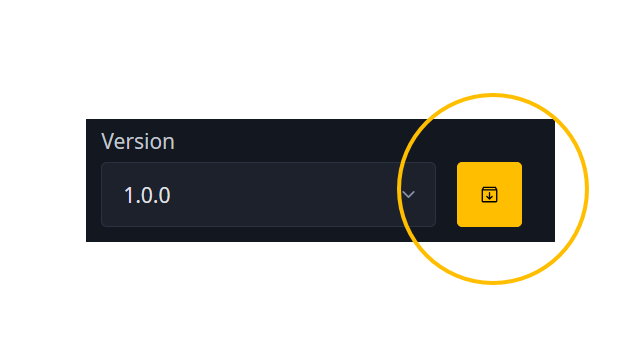
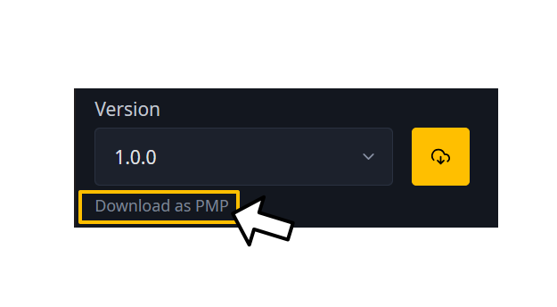

# Downloading PMPs

If you prefer to have PMPs for a mod on hand for archival purposes, 
or need to update an existing mod on Heliosphere
from a pre-*Dawntrail* state using Textools' updating features, 
then you have the option to download the mod as a PMP file.

Note that if you do not have the Heliosphere plugin [installed][installation.md],
or if *Final Fantasy XIV* is currently not open while you are browsing Heliosphere,
you will always download mods from Heliospheres as PMPs. 
Whenever you are downloading a mod as a PMP due to either of these two situations, 
this will be denoted by the download icon appearing as indicated below.

If *Final Fantasy XIV* is open with the Heliosphere plugin installed, 
then you will need to click on "Download as PMP" below the version number.

