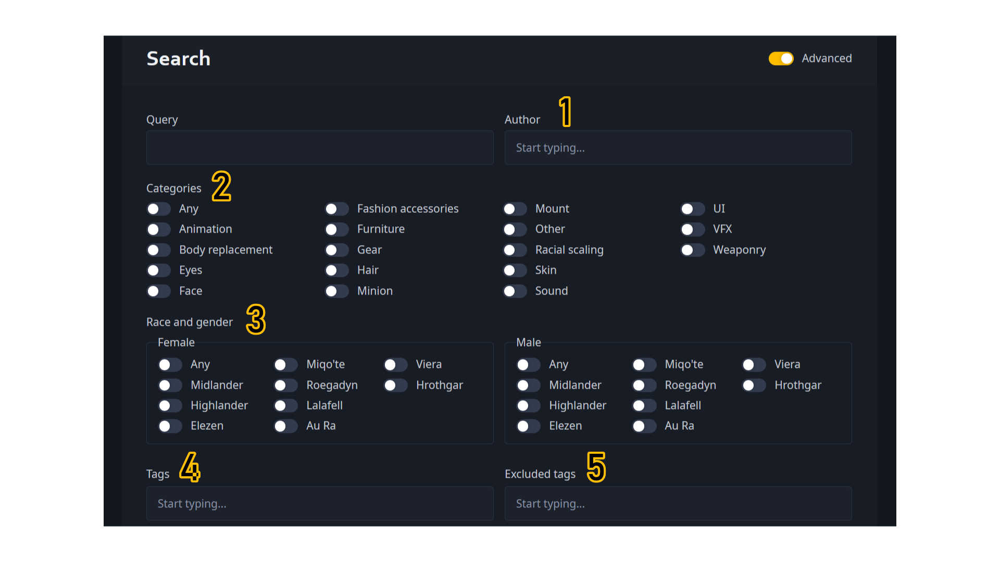
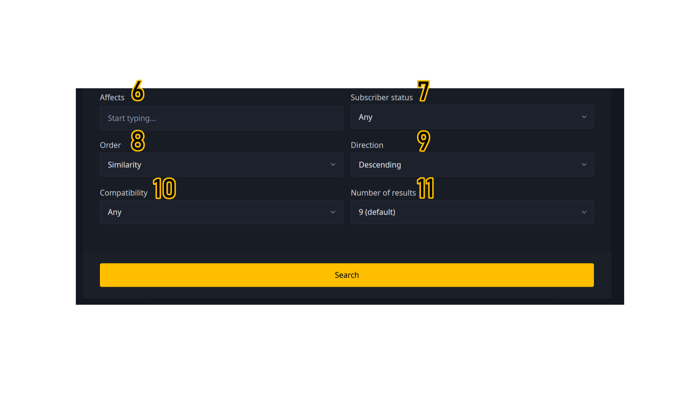
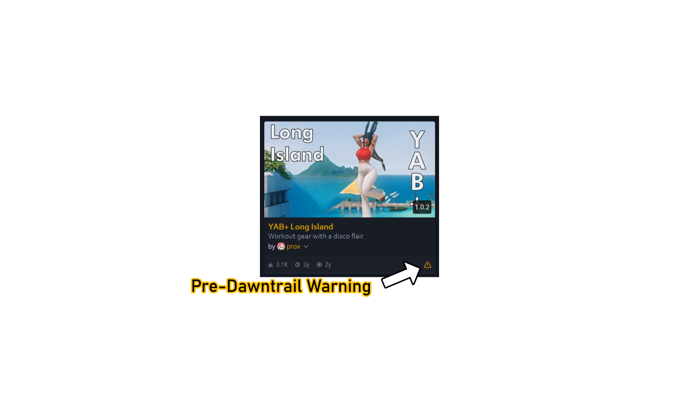

# Searching

Heliosphere's search function has two primary modes: ***Simple*** and ***Advanced***.

## Simple Search

The simple search will go through titles and descriptions both, and will pull up any mods with matching terms or words.
To use this, simply put your desired search terms in the query box and hit "Search."

(image)

## Advanced Search

Clicking the ***Advanced*** slider at the top of the screen or the text that says "Enable advanced search" 
below the main query box will enable the advanced search.
The Query box retains its function from Simple Search, but there are a number of other items added by advanced search.

1. ***Author.*** If you know a specific author's name and want to limit your search to only the mods they have made, 
you can type either their full or partial name here,then select their name from the dropdown menu if Heliosphere is able to identify their name.

2. ***Categories.*** This section specifies which types of mods you want to show up in the search. 
You may select multiple options at the same time.

3. ***Race & gender.*** This section is split into a Female and a Male section, 
and allows you to find mods that are compatible with all the combinations of race and gender that are chosen in the two boxes. 
Selecting "Any" for either gender will choose all the races for that gender.

4. ***Tags.*** You may search for tags that mods have been given in this section, 
and add them as additional filters to your search.
Mods with these tags will then appear in the search results.
You may add as many of these as you like.
In addition to tags that are automatically assigned by Heliosphere to uploaded mods, 
you may search for custom tags added by the creators of the mods.

5. ***Excluded tags.*** Any mods with tags that are included in this section will not be included in your search.
You may add as many of these as you like.

6. ***Affects.*** If you know the in-game name of the gear item, action, NPC, or emote that you would like to find a mod to affect, 
then you may add it in here.
You may add as many of these as you like.

7. ***Subscriber status.*** This option will allow you to limit your results to include mods only from Heliosphere creators that are subscribers
(creators who are supporting the upkeep costs of Heliosphere by paying a monthly fee), exclude mods from Heliosphere supporters, or make no distinctions.

8. ***Order.*** This option lets you choose how your search results are sorted, in combination with the next option on this list, ***Direction.***
- *Created at* will sort mods by the date they were created.
- *Downloaded at* (don't know with this one yet)
- *Downloads (all time)* will sort mods by their **total** number of downloads.
- *Downloads (average)* will sort mods by their **average** number of downloads.
- *Similarity* will sort mods by how similar they are to your initial search query.
- *Updated at* will sort mods by when they were updated.

9. ***Direction.*** Choosing *Ascending* will, in combination with ***Order***, sort the results from lowest to highest; 
*Descending* will sort the results from highest to lowest. 
If ***Order*** relies on a date, such as "Created at" or "Updated at", *Ascending* will sort from oldest to newest, while *Descending* will sort from newest to oldest.

10. ***Compatibility.*** Mods that were uploaded or last updated prior to June 28, 2024 will have preceded the release of *Dawntrail*, the fifth major expansion to 
Final Fantasy XIV since A Realm Reborn. 
Because *Dawntrail* made major graphical changes to the engine, any mods that predate the release of *Dawntrail* will likely not function correctly when downloaded
into Penumbra through Heliosphere. These mods will be marked with a warning sign on their thumbnails, both on the main page and in search results.

Selecting "Any" will include these mods in your search results, while selecting "Dawntrail" will exclude them.

11. ***Number of results.*** This simply controls how many search results are shown per page in your search.